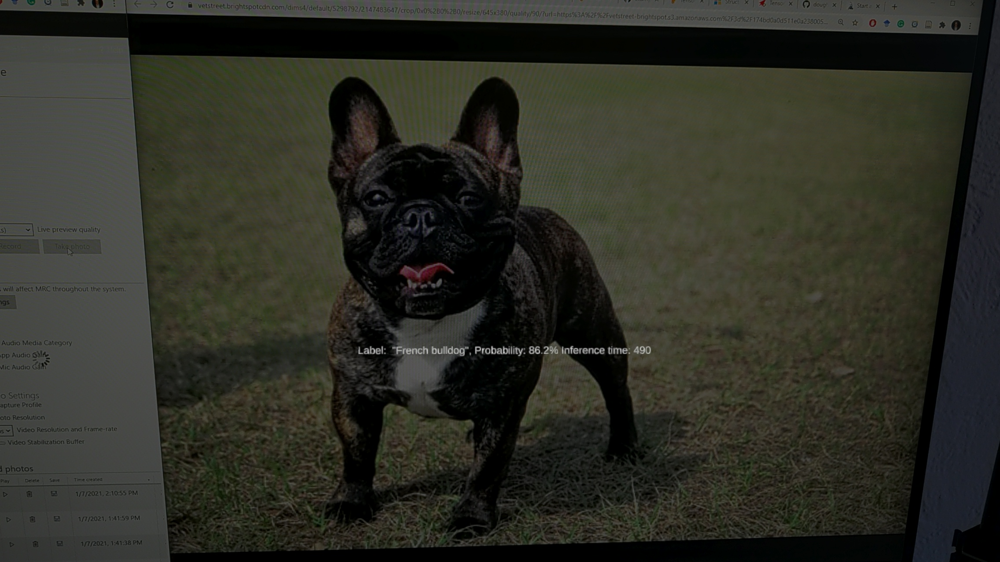

# HoloLens-2-Machine-Learning
Using the `EfficientNetB0` model, trained on the `ImageNet` 1000 class dataset, for image classification. Model inference is run directly on the HoloLens 2 using its onboard CPU. 

## About
- Tested with Unity 2019.4 LTS, Visual Studio 2019, and the HoloLens 2
- Building off of the [WinMLExperiments](https://github.com/reneschulte/WinMLExperiments) sample from Rene Schulte
- Input video frames of size `(224, 224)` for online inference
- Pretrained TensorFlow-Keras implementation of the EfficientNetB0 framework was converted directly to ONNX format for use in this sample

## Run sample
- Open sample in Unity
- Switch build platform to `Universal Windows Platform`, select `HoloLens` for target device, and `ARM64` as the target platform
- Build Visual Studio project and open .sln file
- Copy the `model.onnx` file to the `Builds\HoloLens-2-Machine-Learning\Assets` folder
- Import to Visual Studio project as an existing file, place in the assets folder
- In the asset properties window (as below), confirm that the `Content` field has its boolean value set to `True`. This enables the `ONNX` model to be loaded at runtime from the Visual Studio assets folder

- Build the sample in `Release` mode for `ARM64` and deploy to the HoloLens 2 to test
- Prediction labels are pulled from the parsed ImageNet labels .json file (which includes 1000 image net classes)
- Output includes the `predicted label`, its associated `probability` and the `inference time` in milliseconds 

